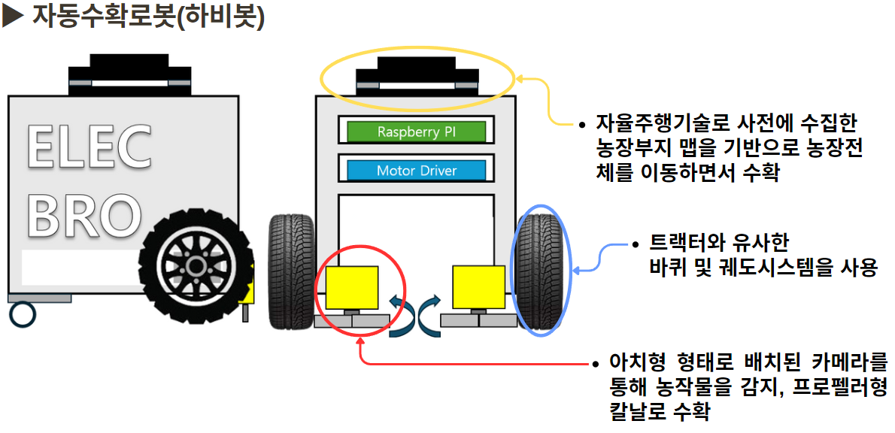
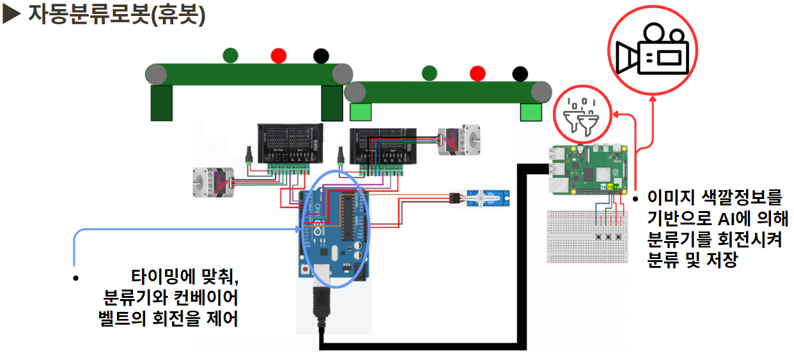
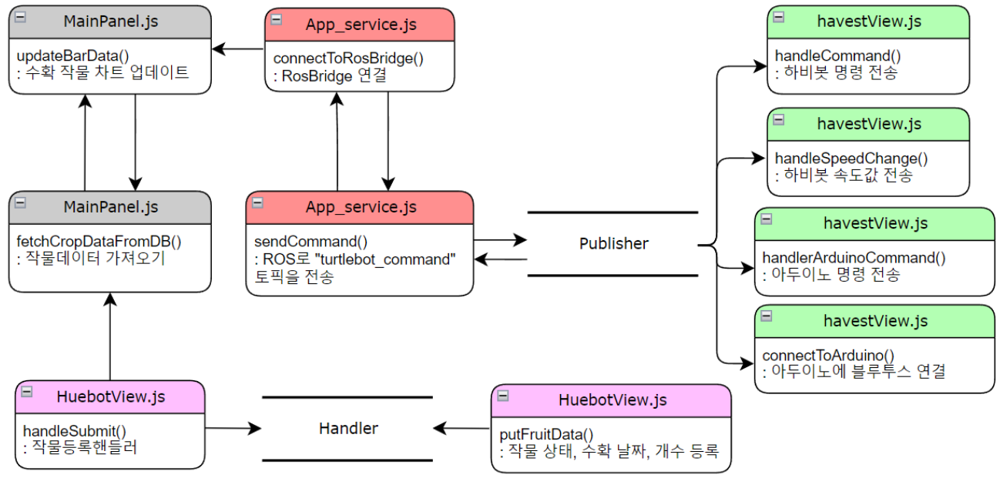
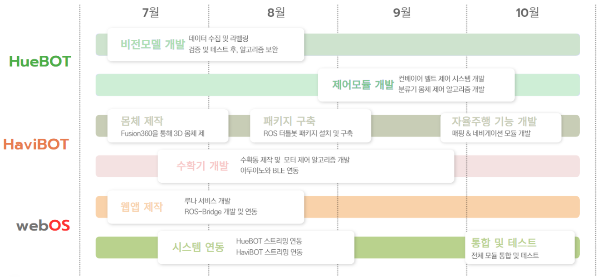
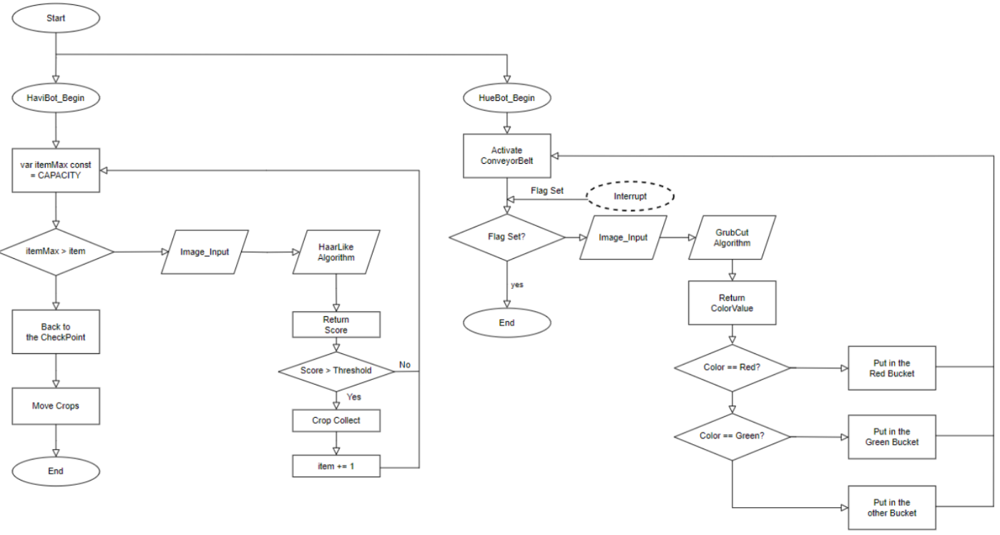
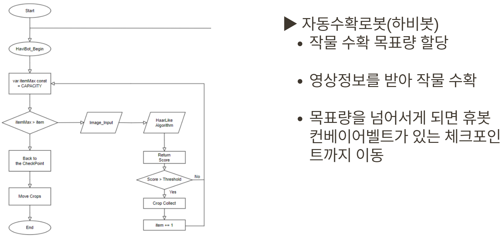
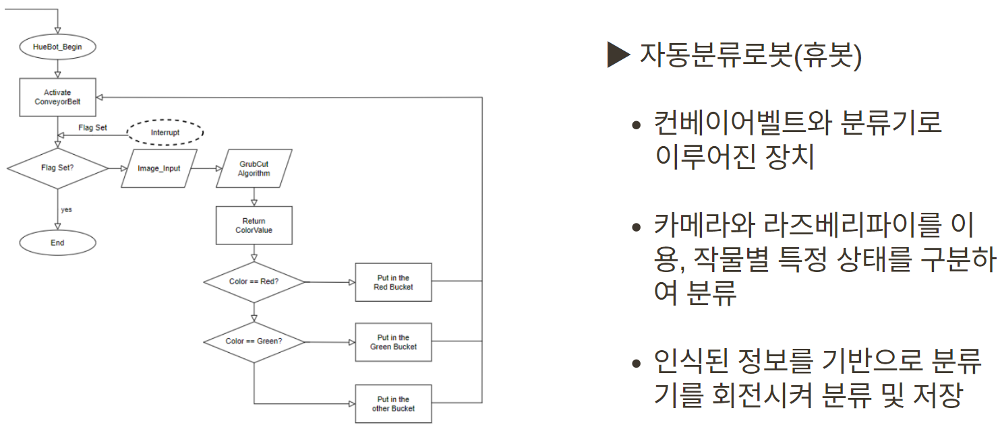

# 2024임베디드SW경진대회(webOS부문) - ELECBRO팀
<p align="center">
  <br>
 	
  <br>
</p>


# 작품 명: AGRIBOT

## ✨작품개요
**"농업의 미래를 바꾸다", 자동화 작물공정 혁신 솔루션, AGRIBOT**<br>
고령화로 인한 농업인력의 감소와 외국인 노동자의 연봉 상승에 따른 생산비 증가,
→ webOS를 활용, 작물 수확 및 분류를 원스톱으로 진행하는 자동화 솔루션을 제안,


## 💡개발환경



#### ▶자동수확로봇(하비봇)

- 자율주행기술로 사전에 수집한 농장부지맵을 기반으로 농장전체를 이동하면서 수확
- 트랙터와 유사한 바퀴 및 궤도시스템을 사용
- 아치형 형태로 배치된 카메랄를 통해 농작물을 감지, 프로펠러형 칼날로 수확




#### ▶자동분류로봇(휴봇)

- 이미지 색깔정보를 기반으로 AI에 의해 분류기를 회전시켜 분류 및 저장
- 타이밍에 맞춰, 분류기와 컨베이어 벨트의 회전을 제어


##  💻아키텍처


## 🎮기능

### webOS

- 모니터링기능
- 작물관리기능
- 로봇제어기능
- 비전모델 관리기능


### HAVIBOT

- 자율주행/수동주행 기능
- 작물수확기 제어기능

- 실시간 영상 스트리밍 기능


### HUEBOT

- 작물 이미지 식별 기능
- 작물 분류 기능
- 실시간 영상 스트리밍 기능


## 📂파일구성

```bash
📦2024ESWContest_webOS_3012
┃📦HaviBot
┃ ┣ 📂body_module
┃ ┃ ┗ 📜body_module.c
┃ ┣ 📂catkin_ws
┃ ┃ ┗ 📂waypoint_navigation
┃ ┃ ┗ 📂rosbridge_websocket
┃ ┃ ┗ 📂turtlebot_controller
┃ ┃ ┗ 📂camera
┃ ┃ ┗ 📂vel_control
┃ ┗ 📂dc_module
┃ ┃ ┣ 📂dcmotor_control_for_linux
┃ ┃ ┃ ┗ 📜dcmotor_control.ino
┃📦HueBot
┃ ┣ 📂ConveyerBelt
┃ ┣ 📂Vision_System
┃ ┃  ┣ 📂capturing_module
┃ ┃  ┣ 📂classifing_module
┃ ┃  ┣ 📂detecting_module
┃ ┃  ┣ 📂streaming_module
┃ ┃  ┣ 📂models
┃📦webOS
┃ ┣ 📂app
┃ ┣ 📂appservice
┃ ┣ 📂arduino
┃ ┣ 📂videoserver
```


## ✔️함수구성




## 📋개발일정




## 📑업무분장

**"농업의 미래를 앞당기는 팀원들"**

| Profile | Role | Part | Tech Stack |
| ------- | ---- | ---- | ---------- |
| <div align="center"><a href="https://blog.naver.com/yhon89"><br/><sub><b>김현근</b><sub></a></div> | 팀장 | webOS구축, Luna-Service 개발 | NodeJS, ReactJS, Arduino, MongoDB, Arduino |
| <div align="center"><a href="https://blog.naver.com/yhon89"><br/><sub><b>윤성웅</b><sub></a></div> | 팀원 | 프로세서 설계,YOLOv5 API 개발, Vision Model 개발 | Pytorch,OpenCV,RaspberryPI,AUTOSAR |
| <div align="center"><a href="https://blog.naver.com/yhon89"><br/><sub><b>박진석<sub></a></div> | 팀원 | ROS개발환경 구축, Turtlebot 개발, ROS-Bridge 개발 | NodeJS, MongoDB, ROS, PointCloud |
| <div align="center"><a href="https://blog.naver.com/yhon89"><br/><sub><b>김재원</b><sub></a></div> | 팀원 | 데이터 수집 및 라벨링, 데이터 학습 | Python, tkinter, NodeJS, ReactJS, Arduino |
| <div align="center"><a href="https://blog.naver.com/yhon89"><br/><sub><b>김용진</b><sub></a></div> | 팀원 | 프로토타입 설계, 스마트팜 부지 설계 | C/C++, Arduino, Fusion360, P-Spice |


### 📣Team SLOGAN

**Accelerating the World's Transition to Sustainable Agriculture.**

**“지속가능한 농업으로의 전세계적 전환을 가속화한다” with .AGRIBOT.**


## ※Appendix

### I. Q&A

**<질문1>** 스마트팜을 도입하려는 농장주의 재배 작물이 다양할 수 있는데, 사과, 딸기, 오렌지, 참외 등 다양한 작물에 대해 분류할 수 있는 방안이 있나요?

**<답변1>** YOLOv5 기반 비전 모델을 통해 농작물의 범주를 고려한 다양한 비전 모델을 개발할 계획이며, 농장 환경에 맞는 데이터를 확보하면 맞춤형 모델 제작이 가능해 작물 종류에 따른 제약이 없습니다.


**<질문2>** 작물을 재배하거나 운송, 분류할 때 작물의 손상을 줄여야 상품 가치가 높아질 텐데, 일렉브로 팀의 수확 과정에서 작물 손상이 많이 발생하지 않을까요?

**<답변2>** 저희는 상품 가치가 높은 작물의 손상을 줄이기 위해 로봇팔 디자인을 개선하거나, 충격 흡수에 적합한 부드러운 소재를 활용하여 손상 최소화 방안을 마련할 수 있습니다.


**<질문3>** 

**<답변3>** 


### II. Flow Chart



<hr>




<hr>




## III. Contributing

- 윤성웅(전자공학부 20학번): 지능신호처리연구실 학부연구생
- 김현근(전기공학부 19학번): 자율군집SW연구센터 학부연구생
- 박진석(전기공학부 19학번): 임베디드시스템플랫폼 연구실 학부연구생
- 김재원(전기공학부 19학번): 비전연구실 학부연구생
- 김용진(전기공학부 18학번)
- 김동혁(전자공학부 24학번)


### IV. 논문 및 특허

- 박순용,"과수원 환경에서 로봇의 주행 제어 방법 및 이를 수행하기 위한 컴퓨팅 장치", 10-2024-0096958
- 박성호,"영상을 기반으로 한 작물재배 생육 플랫폼 구축을 통한 스마트팜 시스템", 10-2023-0088738
- 박승,"스마트팜 전동 차량의 주행방법 및 그 방법이 적용된 스마트팜 전동차량", 10-2021-0007445
